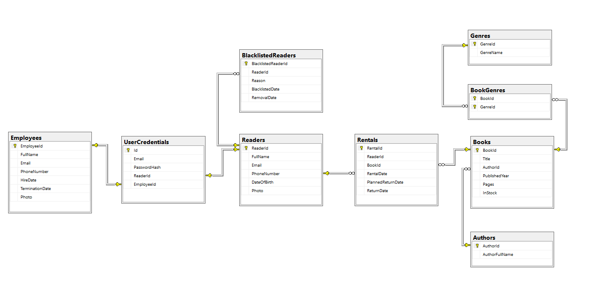

# Librarian
A desktop library management application with support for books, rentals, readers, blacklists, and user accounts. Built with .NET 8.0 and SQL Server.

---

## Table of Contents

- [Detailed Description](#detailed-description)
- [Reader Functionality](#reader-functionality)
- [Employee Functionality](#employee-functionality)
- [Technology Stack](#technology-stack)
- [Database Schema](#database-schema)
- [Installation & Launch](#installation--launch)
- [License](#license)
- [Authors](#authors)

---

## Detailed Description

Librarian is a desktop application built in C# using Windows Forms, with SQL Server LocalDB for data storage and Entity Framework Core for ORM. It provides two user roles — **Reader** and **Employee** — and offers a complete system for managing a small-scale library, including:

- Books (browse, add, edit, sort)
- Readers (browse, view status)
- Rentals (create, return, history)
- Account/profile management (including profile pictures)
- Graphical statistics for book rentals
- Reader blacklist management (by employees only)

Passwords are hashed with SHA256. The app includes a sample database on launch and supports binary profile photo storage.

---

## Reader Functionality

- **Login / Register**
- **Book list** – browse and filter available books
- **Rentals** – rent and return books
- **History** – view past rentals with return dates
- **Account** – view and manage account and profile photo
- **Statistics** – generate rental graphs over a selected time range

---

## Employee Functionality

- **Login**
- **Book management** – add, edit, and remove books
- **Reader management** – view and sort the list of readers
- **Blacklist management** – add or remove readers from blacklist
- **Rental panel** – view and edit ongoing rentals
- **Account** – view employee account data and profile photo

---

## Technology Stack

- **Language:** C# (.NET 8.0)
- **UI:** Windows Forms
- **Database:** SQL Server LocalDB
- **ORM:** Entity Framework Core (Code First)
- **Charts:** ScottPlot
- **Password hashing:** SHA256 via Microsoft.AspNetCore.Cryptography
- **Config secrets:** .NET User Secrets

---

## Database Schema

---

## Installation & Launch

### Prerequisites

- SQL Server LocalDB or SQL Server Express

> SQL Server LocalDB can be installed [here](https://go.microsoft.com/fwlink/?linkid=866658).

---

## License

This project is licensed under the MIT License. See the `LICENSE` file for details.

---

## Authors

- [**Jakub Jagodziński**](https://github.com/JakubJagodzinski)  
- [**Bartłomiej Jaruga**](https://github.com/BartlomiejJaruga)

---
